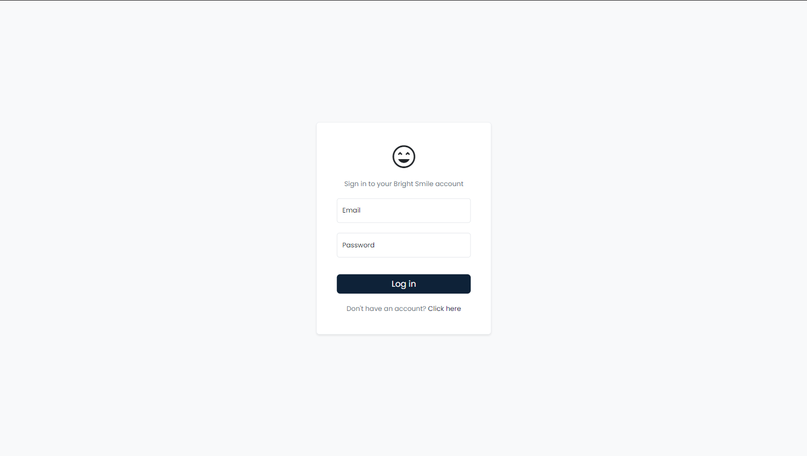

# Bright Smile Clinic Management Platform

## Project Overview

This platform allows users to manage Clinics, Doctors, and Patients.
It includes Affiliations between all those.
The system provides an easy interface to view, add, and edit information about clinics, doctors, and patients, as well as schedule appointments and log visits. 
The platform also exposes a few REST API functionalities for external integrations as well.

## Technology Used

- **Backend**: [Django](https://www.djangoproject.com/start/)
- **Frontend**: HTML, [Bootstrap](https://getbootstrap.com/docs/5.3/getting-started/introduction/), JavaScript ([jQuery](https://jquery.com/))
- **Database**: [PostgreSQL](https://www.postgresql.org/)
- **Authentication**: Django’s built-in authentication system

---

## Features

### User Authentication:
- Users can log in using email and password (leveraging Django's admin functionalities).
- New Users should be created through admin portal.

### Clinics Management:
- View a list of clinics and see details such as name, phone number, city, state, and affiliated doctors and patients count.
- Add and edit clinic details(delete is not included, since not mentioned in given task).
- View, edit and delete doctor affiliations to clinics, including office addresses and working schedules ( Week Schedule ).

### Doctors Management:
- View a list of doctors with information like NPI, name, specialties, number of affiliated clinics, and patients.
- Add and Edit doctor details such as NPI, specialties, and contact information.
- View doctor affiliations to clinics and patients.

### Patients Management:
- View a list of patients, showing key details like name, date of birth, last visit information, and upcoming appointments.
- Edit patient information such as name, address, phone number,last 4 digits of SSN, and gender.
- View and log patient visits, including procedures done and doctor's notes.
- Schedule appointments for patients with available doctors, clinics, date and time slot.

### REST API Endpoints:
- Add Clinic, Doctor, or Patient.
- Get Clinic Information (without affiliated doctors and patients).

---

## Setup Instructions

### 1. Prerequisites
Ensure you have the following installed:
- [Python](https://www.python.org/) 3.x
- PostgreSQL
- pip (Python package installer)
- Virtualenv (optional, but recommended)

### 2. Clone the Repository
```bash
git clone https://github.com/your-repo/clinic-management.git
cd clinic-management
```

### 3. Set Up the Virtual Environment 
```bash
python -m venv venv
venv\Scripts\activate
```

### 4. Install Dependencies
```bash
pip install -r requirements.txt
```

### 5. Database Setup
```bash
psql -U postgres
postgres=# CREATE DATABASE clinic_management;
```

### 6. Database Setup

Give the database details in .env in BrightSmile folder.

```makefile
DB_NAME=BrightSmile
DB_USER=your_postgres_username
DB_PASSWORD=your_postgres_password
```

### 7. Run the migrations to set up the database schema
```bash
Python manage.py makemigrations
Python manage.py migrate
```

### 8. Create a Superuser for Admin Access
```bash
python manage.py createsuperuser
```
Next fill the Email,Username and Password.

### 9. Run the Development Server
```bash
python manage.py runserver

System check identified no issues (0 silenced).
Django version 5.1.1, using settings 'BrightSmile.settings'
Starting development server at http://127.0.0.1:8000/
Quit the server with CTRL-BREAK.
```

Sever is ready, you can now access the platform at http://127.0.0.1:8000/login.

---

## Using the Platform

### Logging In
- **Login Page**:
Visit [http://127.0.0.1:8000/admin/](http://127.0.0.1:8000/login) to log in using the credentials of the superuser you created. After login, you can manage **Clinics**, **Doctors**, and **Patients**.

### Home Page
- **API Details**: Contains all the necessary API information.


### Clinics Tab
- **View**: See a list of clinics with details.
- **Add/Edit**: Add new clinics or edit existing ones by providing information like name, address, phone number, and email.
- **Doctor Affiliations**: Manage doctor affiliations with the clinic, specifying their office address and working schedule.

### Doctors Tab
- **View**: See a list of doctors with NPI, specialties, and affiliated clinics and patients.
- **Edit**: Update doctor details such as NPI, specialties, and contact information.

### Patients Tab
- **View**: See a list of patients with details like last visit and upcoming appointments.
- **Edit**: Update patient information (name, address, etc.).
- **Add Visit**: Log visits with the doctor’s notes and performed procedures.
- **Schedule Appointment**: Schedule appointments by selecting a procedure, clinic, doctor, and available time slot.

### Logout Tab
- **Logout**: This acts as a logout button and let the user logout of the session.
---

## Assumptions

- **Appointment**: Each Appointment is 30 minutes, so a patient can book at least and at most 30 minutes.
- **Work Schedule**: If a doctor works at different locations, it's the responsibility of the user who logs his/her time, as of now we are not checking the doctors times with multiple clinics.
- **Delete/ Edit**: Some records are not editable, some are not deletable and some are both. The functionalities should be limited and any additional things can be done by superuser from admin page.
- **Error Messages**: As all the users are admin users, the errors can be direct Python errors.